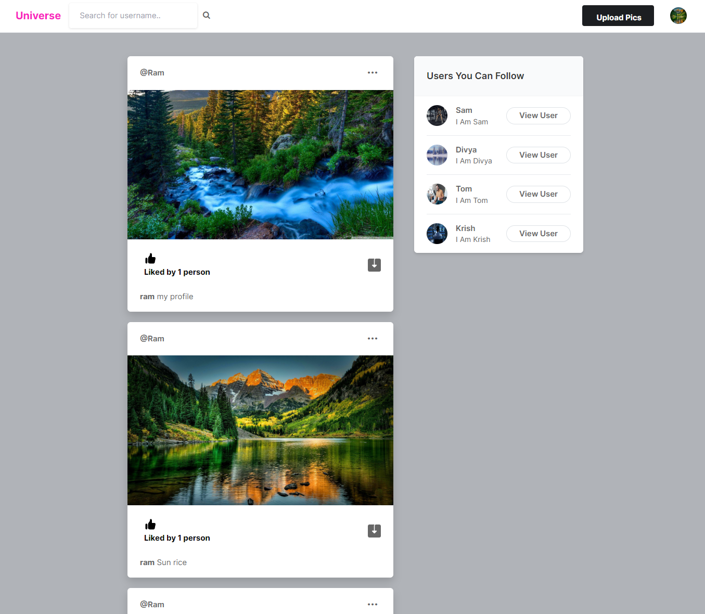
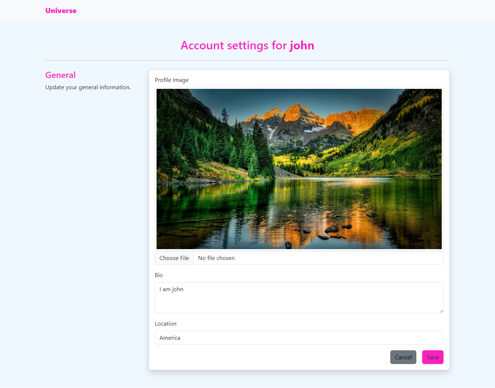
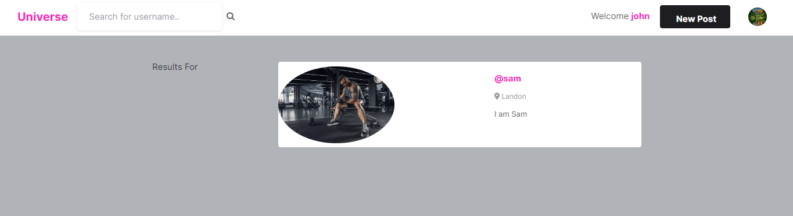

<h1 align="center">Django Universe - Social Media Web App</h1>
<h3 align="center">A simple Social Media App project - Here users can seamlessly create and share posts, browse content from other users, establish connections by following others, efficiently search for users by their usernames, register and log in securely, and receive random recommendations for connecting with other users.</h3>
<br />

### Overview

- [Overview](#overview)
- [Screen Shots](#screen-shots)
- [Tech Stack](#tech-stack)
- [Features](#features)
- [Setup](#setup)
- [Getting ready](#getting-ready)
- [Author](#author)

<br />

### Screen Shots

## SignUp page

# 

## Login page

# 

## Home page

# 

## Profile setting page

# 

## View others profile

# 

## Search results

# 

<br />

### Tech Stack

- Django
- HTML
- CSS
- BOOTSTRAP
- JAVA SCRIPT
- GIT

<br />

### Features

- Django LTS
- Sturctured DataBase
- User Registration and Authentication
- User Profiles
- User Posts
- Viewing Posts
- Following and Followers
- Recommendations
- Search Functionality
- User Settings

<br />

### Setup

To get this repository, run the following command inside your git enabled terminal

```bash
git clone https://github.com/Techkrish1/Universe.git
```

<br />

### Getting ready

Step by step commands on how to run this project on your computer

```
pip install virtualenv
```

1. Install Virtual Environment

```
pip install virtualenv
```

2. Create Virtual Environment

```
virtualenv venv
```

3. Activate virtual env

```
venv/Scripts/activate
```

4. install the dependencies of the project

```
pip install -r requirements.txt
```

5. Once you have installed django and other packages, go to the cloned repo directory and run the following command

```
python manage.py makemigrations
python manage.py migrate
```

6. Create superuser for admin access and follow instruction

```
python manage.py createsuperuser
```

7. Collect static files

```
python manage.py collectstatic
```

8. You can run the server :)

```
python manage.py runserver
```

<br>

### Author

- [@Gokula Krishnan](https://github.com/Techkrish1)
